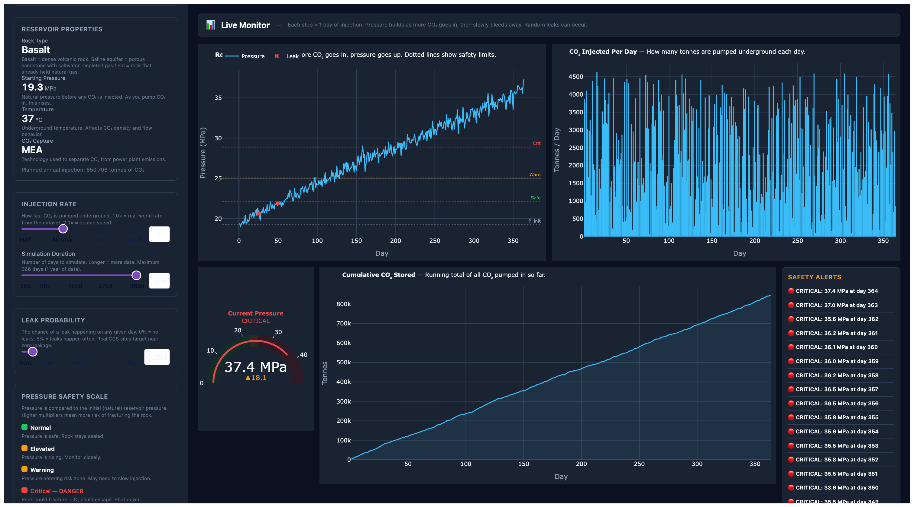

# CCS Realtime Injection Simulator

A web-based CO2 injection reservoir simulator built for SLB SDR internship preparation. Integrates a Python physics engine with a real-time Dash dashboard, streaming simulation state via FastAPI WebSockets.



## What It Does

Models day-by-day CO2 injection into underground reservoirs, simulating:

- **Pressure buildup** — P(t) = P_init + k_inj * cumulative_volume - dissipation(t)
- **Plume migration** — Analytical Nordbotten-Celio radius model by rock type
- **Stochastic leakage** — Configurable daily leak probability with mass tracking
- **Reservoir physics** — 3 rock types (Basalt, Saline Aquifer, Depleted Gas Field) with distinct porosity, injectivity, and dissipation

Streams every timestep live to the dashboard via WebSocket, with safety thresholds (safe/elevated/warning/critical) and leak alerts.

## Architecture

```
Dash Frontend (Plotly)
    ↕ HTTP REST + WebSocket
FastAPI Backend (uvicorn)       POST /simulate   GET /presets   GET /schedule
    ↓                            POST /validate   WS /ws/simulate/{case_id}
CCSSimulator (Python)
    ↓
SCCS-MRV Dataset (CSV)          Daily injection schedules × 10 facilities
```

## Quick Start

```bash
cd CCS
python3 -m venv venv && source venv/bin/activate
pip install -r requirements.txt

# Start API server (port 8000)
uvicorn backend.main:app --reload --host 0.0.0.0

# Start Dashboard (port 8050) — in a second terminal
python frontend/app.py
```

Open http://localhost:8050 — select a facility, adjust rates, click Start.

## Project Structure

```
CCS/
├── README.md                         # You are here
├── CCS_Simulator.png                # Dashboard screenshot
├── requirements.txt                  # Python dependencies
├── pyproject.toml                    # Pytest config
├── data/
│   └── ccs/                          # SCCS-MRV dataset files
│       ├── ccs_injection_daily_v1.0.csv    (10 facilities × 366 days)
│       ├── ccs_injection_monthly_v1.0.csv  (10 facilities × 12 months)
│       ├── ccs_full_dataset_v1.0.csv       (Facility properties: pressure, temp, leaks)
│       └── README.md                       (Data dictionary)
├── backend/
│   ├── simulator.py                  # Physics engine (283 lines)
│   │   ├── Pressure buildup model
│   │   ├── CO2 plume radius
│   │   ├── CO2 density (supercritical)
│   │   ├── Leak injection
│   │   ├── Sensor noise
│   │   └── Async/sync run modes
│   ├── main.py                       # FastAPI app (398 lines)
│   │   ├── GET  /health
│   │   ├── GET  /presets             → all 10 facility configs
│   │   ├── GET  /schedule/{case_id}  → 366-day injection plan
│   │   ├── POST /simulate            → run + return trace + summary
│   │   ├── POST /validate            → geological limit checks
│   │   └── WS   /ws/simulate/{case_id} → real-time streaming
│   └── tests/
│       ├── conftest.py               # Session-scoped simulator fixture
│       ├── test_simulator.py         # 30+ unit tests (physics, edge cases, leak models)
│       └── test_api.py               # 25+ integration tests (HTTP + WebSocket)
└── frontend/
    └── app.py                         # Dash dashboard (938 lines)
        ├── Facility selector + preset info
        ├── Rate × Duration × Leak sliders
        ├── Real-time WebSocket tick loop
        ├── Pressure line chart with safety thresholds
        ├── Injection rate bar chart
        ├── Pressure gauge indicator
        ├── Cumulative CO2 scatter
        ├── Underground pressure heatmap
        ├── Live alert log (leaks, warnings)
        ├── Post-run: Compare × Export CSV × Reset
        └── Dark theme (inter / tabular-nums)
```

## API Endpoints

| Method | Path | Description |
|--------|------|-------------|
| GET | `/health` | Health check, returns available cases |
| GET | `/presets` | All 10 facility presets (reservoir type, P_init, temp) |
| GET | `/schedule/{case_id}` | 366-day injection schedule as JSON |
| POST | `/simulate` | Run simulation, return full trace + summary |
| POST | `/validate` | Validate inputs against geological limits |
| WS | `/ws/simulate/{case_id}` | Stream simulation tick-by-tick |

### Simulate Request (POST /simulate)

```json
{
  "case_id": "CCS-A",
  "days": 90,
  "injection_rate_multiplier": 1.0,
  "leak_probability": 0.003,
  "random_seed": 42
}
```

### Simulate Response

```json
{
  "status": "completed",
  "days_simulated": 90,
  "summary": {
    "total_days": 90,
    "max_pressure_MPa": 22.35,
    "total_co2_injected_tonnes": 450123,
    "final_plume_radius_m": 312.5,
    "leak_event_count": 1,
    "avg_daily_injection_tonnes": 5001
  },
  "trace": [
    {"day": 1, "pressure_MPa": 19.5, "co2_injected": 3781, ...},
    {"day": 2, "pressure_MPa": 19.6, "co2_injected": 712, ...}
  ]
}
```

## Facilities

10 synthetic CCS facilities across 3 reservoir types:

| Case | Reservoir Type | P_init (MPa) | Temp (C) | Capture Tech |
|------|---------------|-------------|----------|-------------|
| CCS-A | Basalt | 19.5 | 45 | Selexol |
| CCS-B | Basalt | 8.0 | 48 | PSA |
| CCS-C | Basalt | 10.9 | 67 | MEA |
| CCS-D | Saline Aquifer | 15.3 | 52 | Amine |
| CCS-E | Basalt | 27.0 | 41 | MDEA |
| CCS-F | Depleted Gas Field | 5.8 | 72 | Selexol |
| CCS-G | Depleted Gas Field | 4.2 | 78 | Amine |
| CCS-H | Depleted Gas Field | 6.5 | 65 | MEA |
| CCS-I | Basalt | 14.7 | 55 | PSA |
| CCS-J | Depleted Gas Field | 5.2 | 70 | MDEA |

## Running Tests

```bash
pytest backend/tests/ -v
```

Full suite covers:
- **Simulator**: data loading, physics models, reservoir types, edge cases, reproducibility, noise
- **API**: health, presets, schedules, simulate, validate, WebSocket streaming, CORS, error handling

## Data Source

SCCS-MRV v1.5 — Synthetic Carbon Capture & Storage dataset aligned with OSDU & Open Footprint (OFP) standards.

- **DOI:** [10.5281/zenodo.17003094](https://doi.org/10.5281/zenodo.17003094)
- **GitHub:** [muktevisree/SCCS-MRV](https://github.com/muktevisree/SCCS-MRV)
- **License:** CC-BY 4.0
- See `data/ccs/README.md` for full data dictionary

## Technologies

| Layer | Technology |
|-------|-----------|
| Frontend | Dash + Plotly (Python) |
| Backend | FastAPI + uvicorn |
| Real-time | WebSockets (websockets lib) |
| Simulation | Custom Python physics engine |
| Testing | pytest (55+ tests) |
| Data | Pandas + SCCS-MRV CSV |
