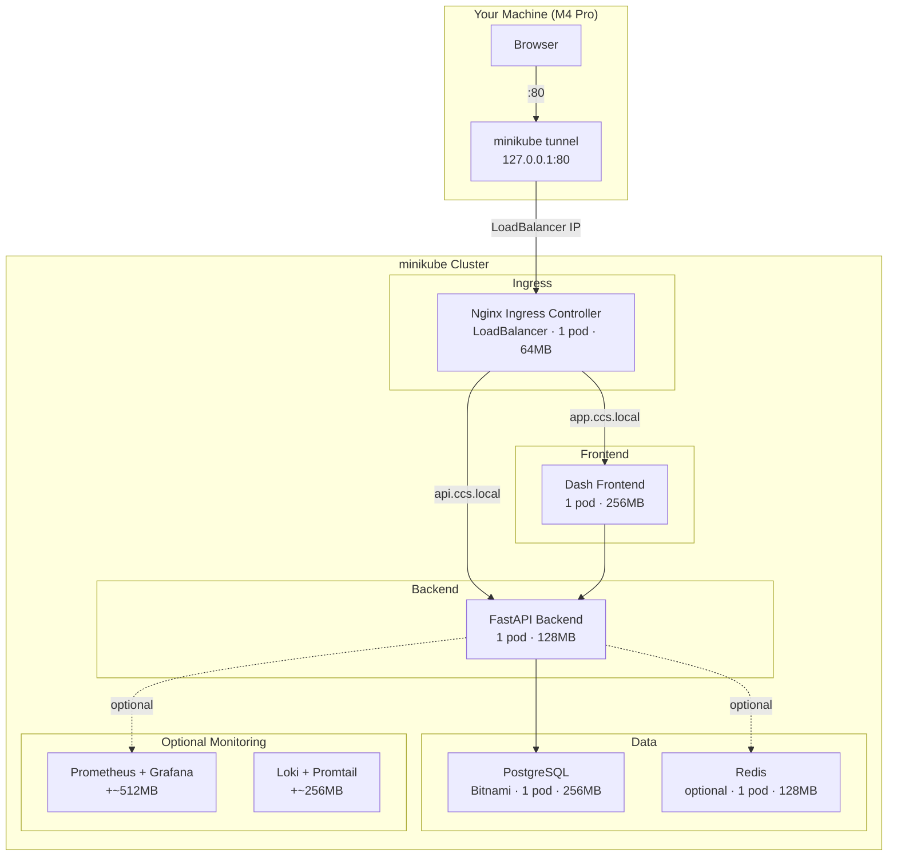
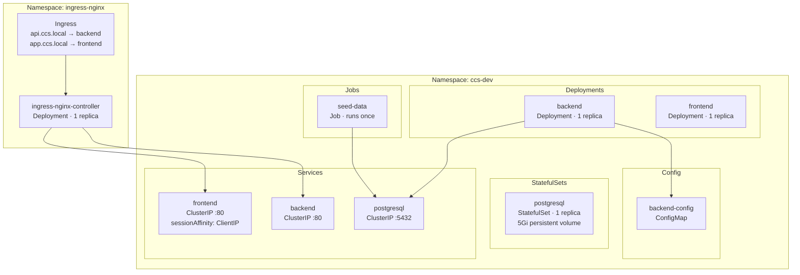
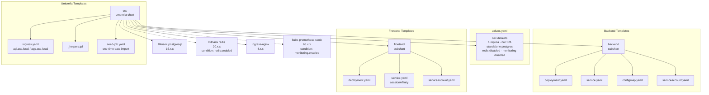
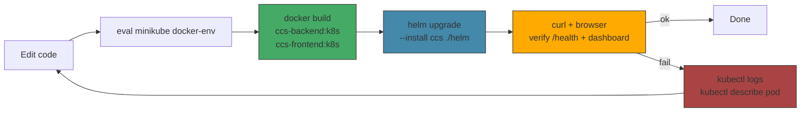
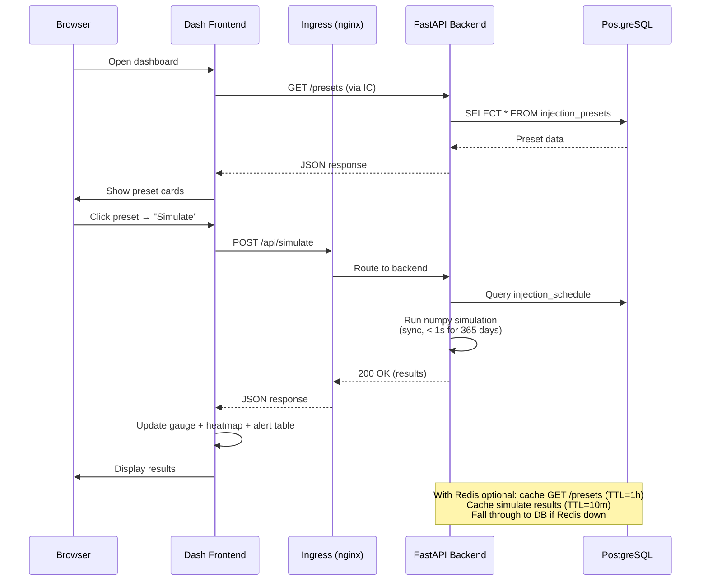

# CCS Architecture Diagrams — Local minikube Dev

## 1. System Architecture — Container View (local minikube)

## 2. Kubernetes Namespace Layout (ccs-dev)

## 3. Resource Budget (M4 Pro 24GB)

```mermaid
graph LR
    subgraph "Core Stack ~2GB"
        C1[minikube OS<br/>~700MB]
        C2[Postgres<br/>256MB]
        C3[Backend<br/>128MB]
        C4[Frontend<br/>256MB]
        C5[Ingress<br/>64MB]
        style C1 fill:#4a6,stroke:#333
        style C2 fill:#4a6,stroke:#333
        style C3 fill:#4a6,stroke:#333
        style C4 fill:#4a6,stroke:#333
        style C5 fill:#4a6,stroke:#333
    end

    subgraph "Optional Extras ~+1.8GB"
        O1[Redis<br/>+128MB]
        O2[Prometheus+Grafana<br/>+512MB]
        O3[Loki+Promtail<br/>+256MB]
        style O1 fill:#fa0,stroke:#333
        style O2 fill:#fa0,stroke:#333
        style O3 fill:#fa0,stroke:#333
    end

    subgraph "Free ~20GB"
        FREE[Available for macOS<br/>browser · other apps]
        style FREE fill:#48a,stroke:#333
    end

    C1 --> C2 --> C3 --> C4 --> C5 --> O1 --> O2 --> O3 --> FREE
```

## 4. Helm Chart Dependency Tree

## 5. Local Dev Workflow

## 6. Request Flow — Simulation (local, sync)

